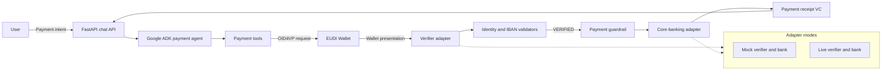

# EUDI TrustPay Agent

Agentic payments secured by EUDI Wallet verification (OID4VP/OID4VCI), with mock and live adapter modes.

```mermaid
flowchart LR
    U[User] -->|Payment intent| API[FastAPI chat API]
    API --> Agent[Google ADK payment agent]
    Agent --> Tools[Payment tools]
    Tools -->|OID4VP request| Wallet[EUDI Wallet]
    Wallet -->|Wallet presentation| Verifier[Verifier adapter]
    Verifier --> Rules[Identity and IBAN validators]
    Rules -->|VERIFIED| Guardrail[Payment guardrail]
    Guardrail --> Banking[Core-banking adapter]
    Banking --> Receipt[Payment receipt VC]
    Receipt --> API

    subgraph Modes[Adapter modes]
        Mock[Mock verifier and bank]
        Live[Live verifier and bank]
    end

    Verifier -.-> Modes
    Banking -.-> Modes
```
